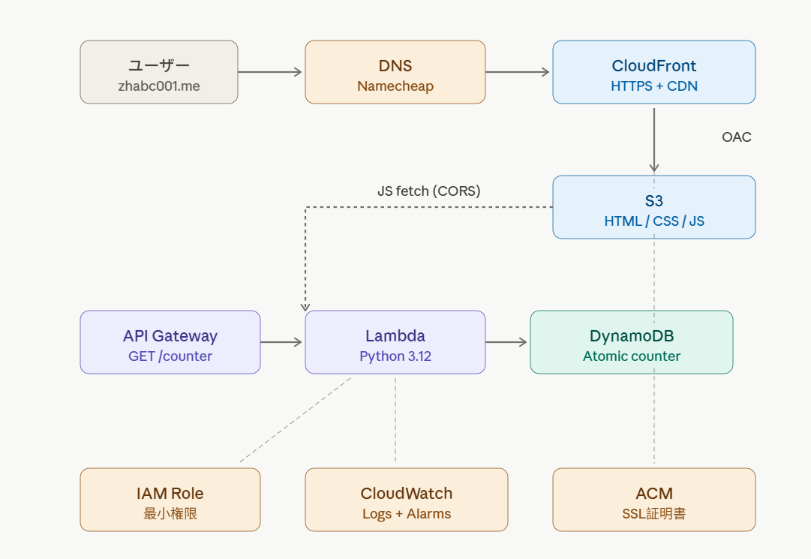

# 📐 アーキテクチャ

# 

# &#x20;全体構成

# 

# 

# 

# &#x20;データフロー

# 

# !\[Data Flow](assests/architecture-flow.png)

# 

# &#x20;🌟 概要

# 

# The Cloud Resume Challenge を AWS 上で実装したプロジェクト。

# SRE / インフラエンジニアの観点から、可観測性とコスト最適化を意識した設計。

# 

# ライブデモ:

# \- HTTP: http://resume.zhangbeichuan.s3-website-ap-northeast-1.amazonaws.com

# \- HTTPS: https://zhabc001.me（CloudFront 設定後追加予定）

# 

# &#x20;🛠️ 使用技術

# 

# | カテゴリ | 技術 |

# |---------|------|

# | Cloud | AWS (S3, Lambda, DynamoDB, API  Gateway,CloudWatch, IAM) |

# | Frontend | HTML, CSS, JavaScript |

# | Backend | Python 3.12 |

# | IaC | Terraform（追加予定） |

# | CI/CD | GitHub Actions（追加予定） |

# | DNS | Namecheap |

# 

# &#x20;🎯 機能

# 

# \- ✅ HTML/CSS による履歴書ページ

# \- ✅ S3 静的ウェブサイトホスティング

# \- ✅ DynamoDB による訪問者カウンター

# \- ✅ Lambda + API Gateway による REST API

# \- ✅ CORS 設定による CDN-Backend 連携

# \- 🚧 CloudFront による HTTPS 化（AWS アカウント検証待ち）

# \- 🚧 カスタムドメイン (zhabc001.me) 関連付け（同上）

# \- ⏳ Terraform による Infrastructure as Code 化

# \- ⏳ GitHub Actions による CI/CD パイプライン

# \- ⏳ CloudWatch Alarm によるエラー監視

# 

# &#x20; SRE 観点での設計考慮事項

# 

# &#x20;可観測性 (Observability)

# \- CloudWatch Logs による Lambda 実行ログ

# \- 構造化ログによるエラー追跡（実装中）

# \- CloudWatch Alarm によるエラー率監視（実装予定）

# 

# \### コスト最適化

# \- AWS Always Free Tier の最大活用

# &#x20; - Lambda: 100万リクエスト/月（永続無料）

# &#x20; - DynamoDB: 25GB ストレージ（永続無料）

# &#x20; - CloudFront: 1TB 流量/月（永続無料）

# \- 全リソースに Standard Tag 付与によるコスト追跡

# \- 月額予算アラート設定（$1）

# 

# &#x20;セキュリティ

# \- IAM 最小権限の原則

# \- DynamoDB atomic counter による並行アクセス対策

# \- CORS 設定によるクロスオリジン制御

# \- OAC による S3 バケットの保護（CloudFront 設定後）

# 

# 💡 技術的こだわりポイント

# 

# &#x20;1. DynamoDB Atomic Counter

# &#x20; python

# table.update\_item(

# &#x20;   Key={'id': 'visitor\_count'},

# &#x20;   UpdateExpression='ADD #count :inc',

# &#x20;   ExpressionAttributeNames={'#count': 'count'},

# &#x20;   ExpressionAttributeValues={':inc': 1},

# &#x20;   ReturnValues='UPDATED\_NEW'

# )

# ```

# ADD operation を使い、race condition を回避。

# 

# &#x20;2. Lambda パフォーマンス最適化

# boto3 クライアントを関数外で初期化し、ウォームスタート時の

# 初期化コストを削減。

# 

# &#x20;3. CORS 設定

# \- API Gateway 側で OPTIONS preflight 対応

# \- Lambda レスポンスにも CORS Headers 設定（多層防御）

# 

# &#x20;📝 開発ログ

# 

# 詳細な開発ログは \[DEVLOG.md](DEVLOG.md) を参照。

# 

# &#x20;🚀 今後の改善計画

# 

# \- \[ ] CloudFront による HTTPS 化（カスタムドメイン）

# \- \[ ] Terraform による全リソースの IaC 化

# \- \[ ] pytest + moto による Lambda 単体テスト

# \- \[ ] GitHub Actions による CI/CD パイプライン

# \- \[ ] CloudWatch Alarm + SNS によるエラー通知

# \- \[ ] Lambda 構造化ログへの移行

# \- \[ ] AWS WAF によるセキュリティ強化（コスト次第）

# \- \[ ] X-Ray による分散トレーシング

# 

# &#x20;📊 学んだこと

# 

# このプロジェクトを通じて学んだ主な技術:

# 

# \- AWS: S3, Lambda, DynamoDB, API Gateway, IAM, CloudWatch

# \- Python: boto3, エラーハンドリング, Lambda 関数開発

# \- Web: HTML/CSS, JavaScript fetch API, CORS, HTTP プロトコル

# \- DevOps: Git, GitHub, Conventional Commits

# \- SRE 観点: 可観測性、コスト最適化、最小権限の原則

# 

# \## 👤 作者

# 

# 張 北川 (ZHANG BEICHUAN)\*\*

# \- 千葉工業大学 大学院 マネジメント工学専攻 (2027年3月卒予定)

# \- AWS Certified Solutions Architect - Associate

# \- GitHub: \[@ZHABC001](https://github.com/ZHABC001)

# \- Email: qingfengtiansuo@gmail.com

# 

# \## 📄 ライセンス

# 

# MIT License

